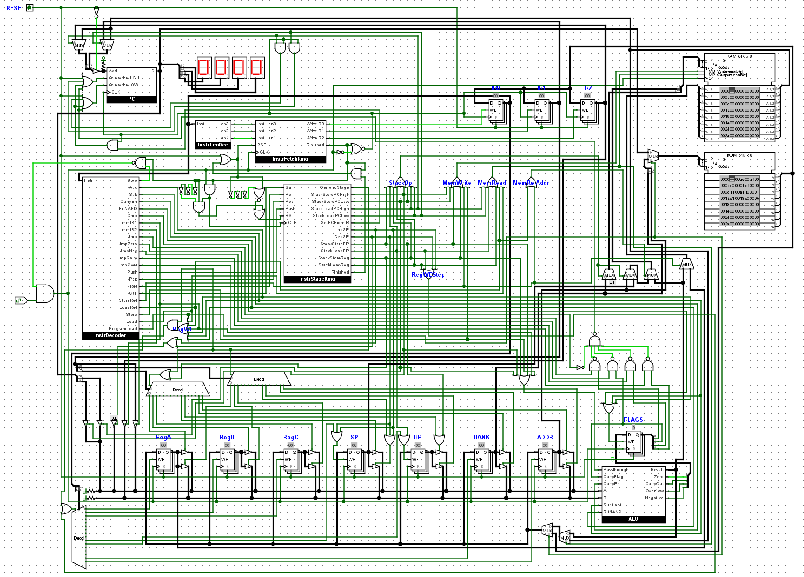

# BJT 8 bit CPU

Designing and (hopefully) building a custom 8 bit CPU with NPN bipolar junction transistors

The [ISA](specification.txt) is fully working and implemented in [logisim](logisim-prototypes/cpu-rebuild.circ), as shown:

I have also written an [assembler](assembler/assembler.cpp), and am working on the [emulator](emulator/) (functional but some graphics issues).

## Physical build
I have [prototyped the ALU on breadboards](images/8bit-alu-labelled.png), and have started [working on PCB components](images/pcb-8bit-reg-v3-refined.png).

### "Just use ICs"
No
